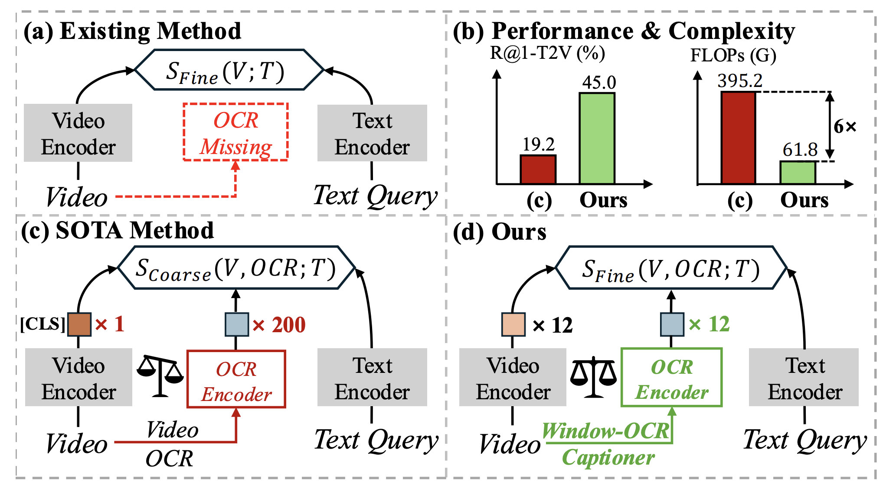
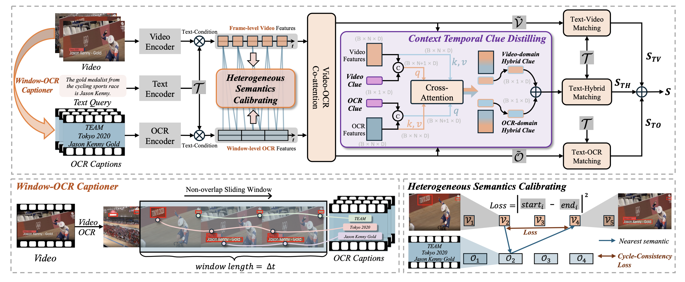
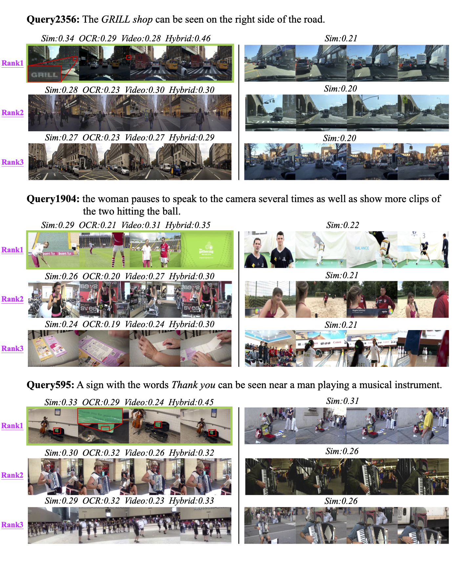
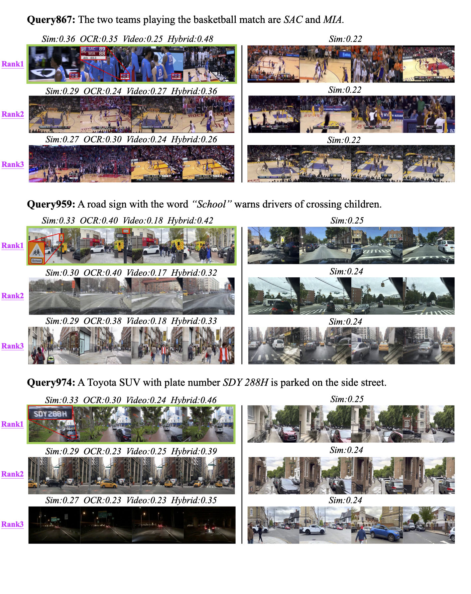

# Temporal Scene-Text Calibrating and Distilling for Text-Video Retrieval

## [1/6] Abstract

Existing text-video retrieval (TVR) methods mainly focus on aligning single-modal video content with text queries, overlooking heterogeneous scene text in videos. While scene text offers fine-grained semantics for cross-modal matching, its effective utilization faces two critical challenges: (1) The temporal density of scene text imposes substantial computational burdens, and (2) Redundant scene text and irrelevant video frames hinder the learning of clear temporal clues for retrieval. In this paper, we propose a temporal scene-text calibrating and distilling (T-CARD) network to encode scene text efficiently while capturing clear temporal clues. Concretely, we first design a window-OCR captioner that aggregates abundant scene text in videos into condensed sentences to reduce computational complexity. Then, we leverage the heterogeneous scene text as a self-supervised signal to calibrate the synchronization between window-level OCR captions and frames-level video sequences. Furthermore, we devise a context temporal clue distillation to capture the complementarity and relevance among scene text and video frames, generating clear temporal clues for retrieval. Extensive experiments show T-CARD achieves SOTA results on two scene text TVR datasets and one traditional TVR dataset.

**The source code and trained models will be released soon.**

## [2/6] Task Introduction

    <figure>
        
    </figure>

*Figure 1: (a) Existing methods overlook the fine-grained scene text
in videos. (b) T-CARD achieves better performance with lower
complexity. (c) SOTA method [52] handles scene text as an instance, resulting in token imbalance issue that hinders fine-grained
interaction. (d) Our window-OCR captioner aggregates abundant
scene text into condensed sentences for fine-grained interaction.*

## [3/6] MODEL ARCHITECTURE

*Figure 2: Pipeline of the proposed **T-CARD**. Window-OCR captioner is leveraged to aggregate abundant scene text into condensed OCR captions. Heterogeneous semantics calibrating uses scene text in both video frames and OCR captions as a signal for self-supervised learning. Context temporal clue distilling assigns each modal query with a learnable clue to obtain a clear context temporal clue.*

<!-- 

    <figure>
        <video controls style="width: 100%;">
            <source src="video.mp4" type="video/mp4">
            Your browser does not support the video tag.
        </video>
    </figure>

 -->

## [4/6] Window-OCR Captioner

    <figure>
        
    </figure>

*Figure 3: Visualization of the proposed Window-OCR Captioner. We aggregrate different kinds of scene texts appearing within a window length of ∆t into a single caption to reduce the feature length from N in previous works (e.g., StarVR) to 1.*

<!-- 

    <figure>
        <video controls style="width: 100%;">
            <source src="video2.mp4" type="video/mp4">
            Your browser does not support the video tag.
        </video>
    </figure>

 -->

## [5/6] Text→Video Retrieval Results (1/2)

*Figure 4: Visualization of retrieval results comparing our method (left) with the model without OCR information (right). Sim indicates the overall similarity
score, calculated as the average of text-OCR, text-video, and text-hybrid matching scores, denoted as OCR, Video, and Hybrid, respectively. Our T-CARD captures fine-grained scene text, such as "GRILL" and "Thank you" with high similarity and hybrid scores. Please zoom in for a better view of the details.*
## [6/6] Text→Video Retrieval Results (2/2)

*Figure 5: Visualization of retrieval results comparing our method (left) with the model without OCR information (right). Sim represents the overall similarity
score, calculated as the average of text-OCR, text-video, and text-hybrid matching scores, denoted as OCR, Video, and Hybrid, respectively. Our T-CARD captures fine-grained scene text, such as "SAC MIA", "School", and "SDY 288H" with high similarity and hybrid scores. Please zoom in for a better view of the details.*
